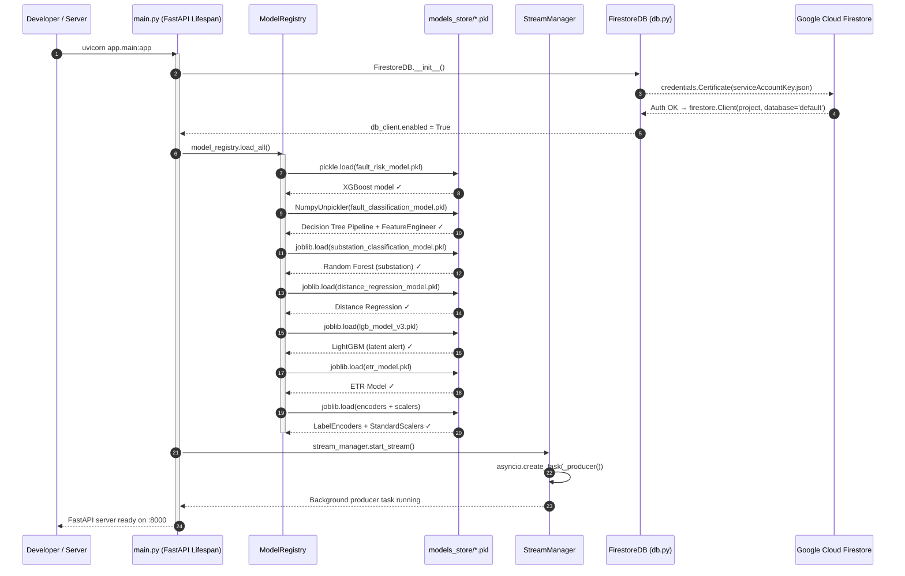
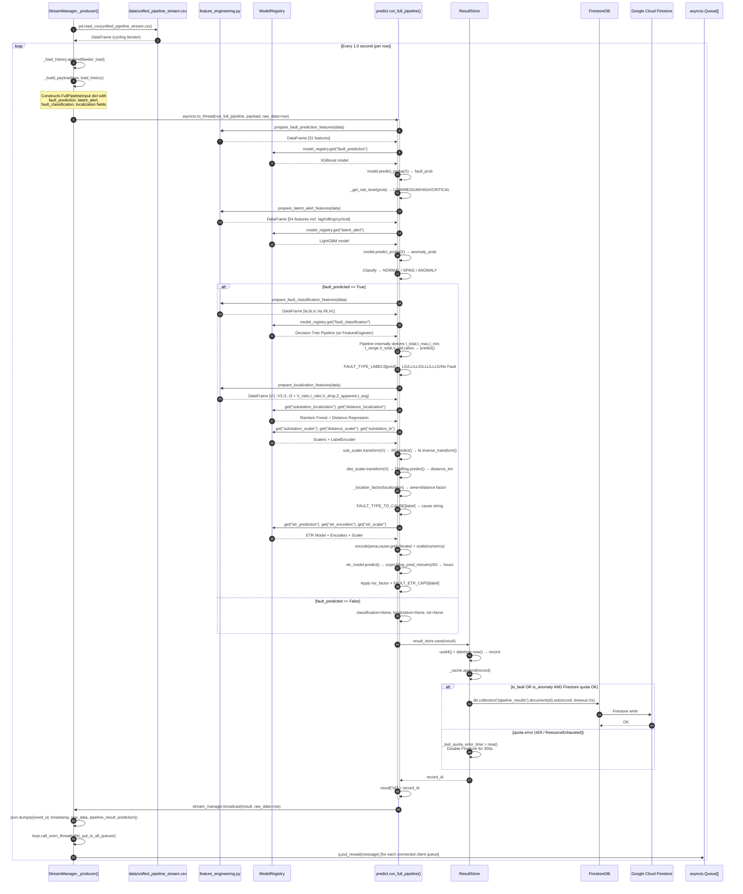
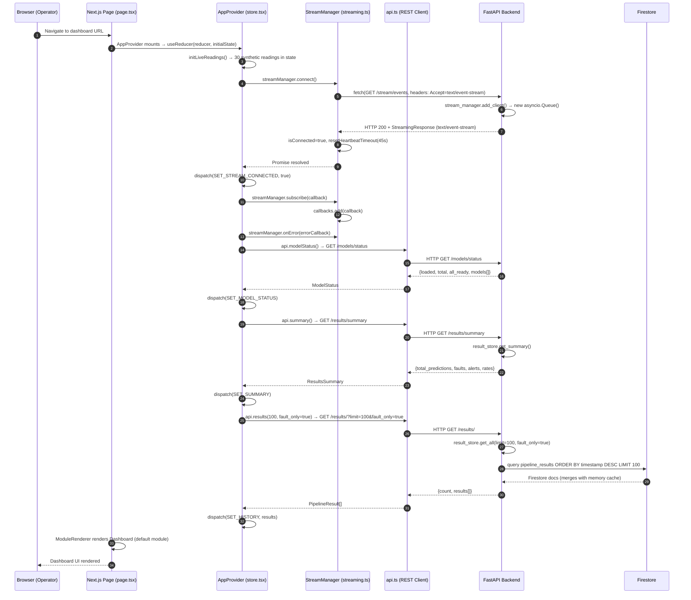
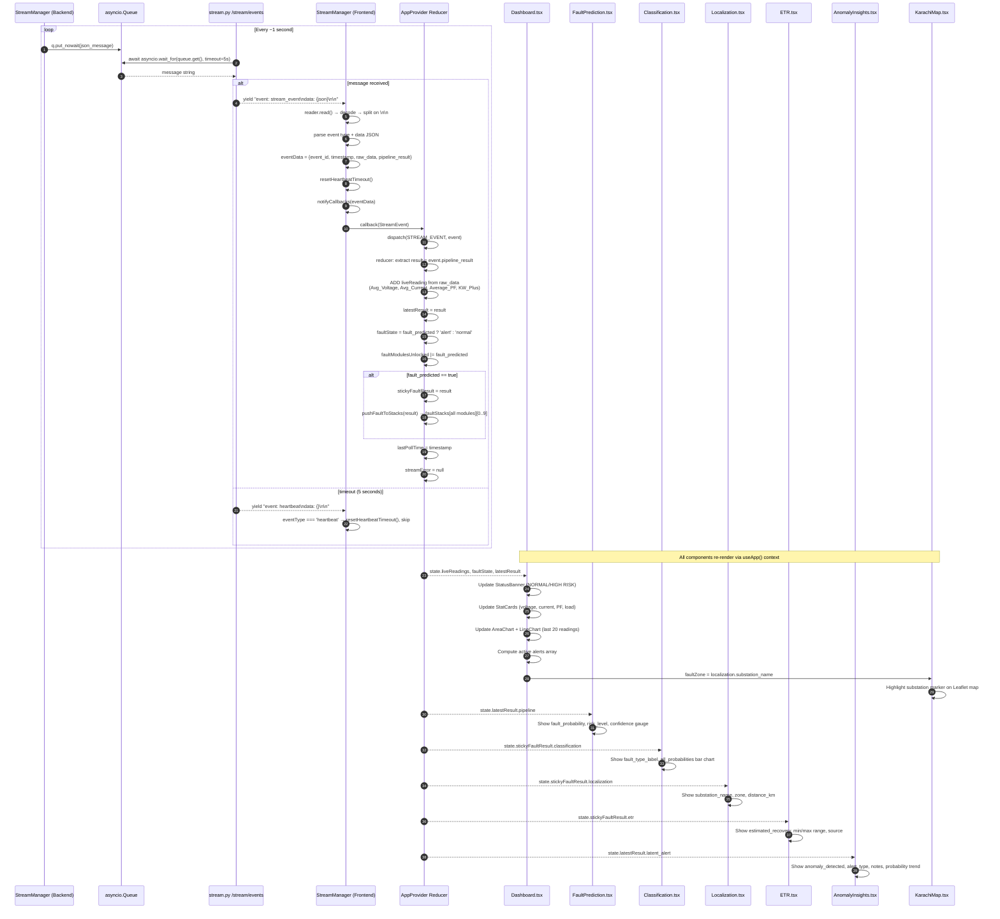
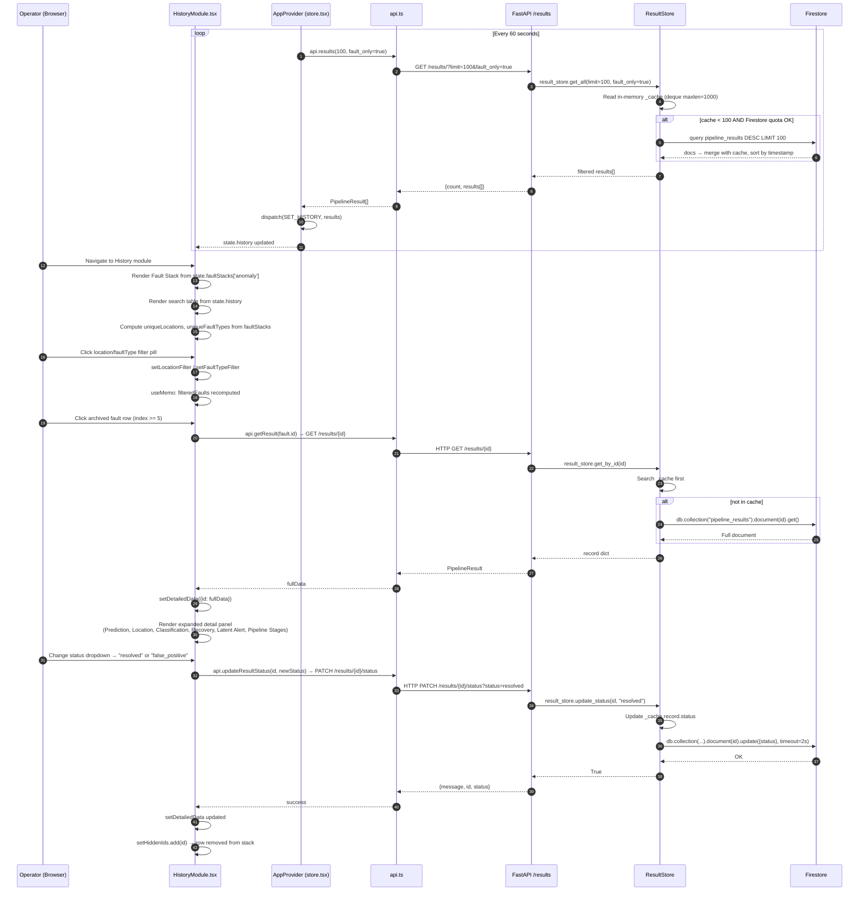
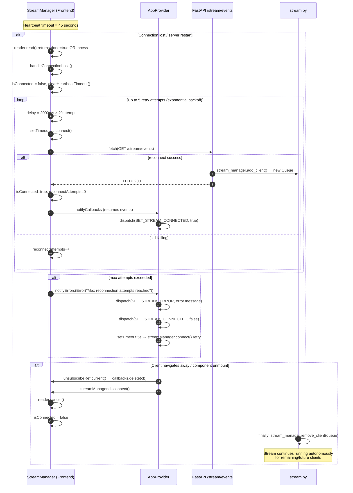
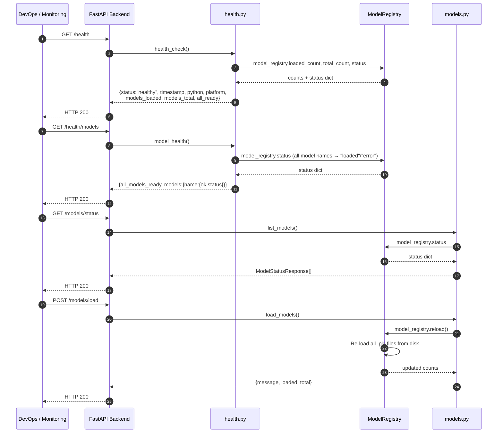
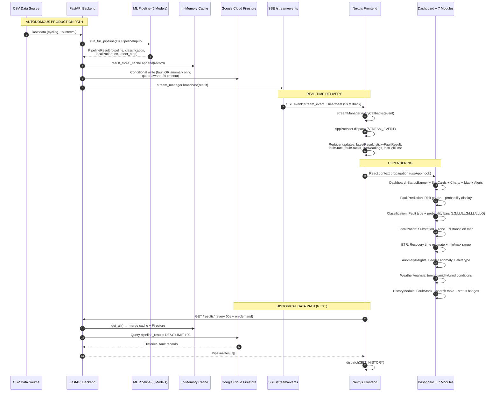

# GridGuard — Full System Sequence Diagram

> Covers every module end-to-end: backend startup, ML pipeline, SSE streaming, Firestore, and all frontend UI modules.

---

## 1. System Startup & Initialization

---

## 2. Autonomous ML Producer Loop (Background Task)

---

## 3. Frontend Initialization & SSE Connection

---

## 4. Real-Time SSE Event Flow → Frontend State Update

---

## 5. History Module — Polling, Lazy Loading & Status Update

---

## 6. SSE Reconnection & Error Recovery

---

## 7. Health Check & Model Management API

---

## 8. Complete Data & Component Architecture Summary

---

## Actors & Components Legend

| Actor | Description |
|---|---|
| **FastAPI main.py** | Entry point — lifespan manages startup/shutdown |
| **ModelRegistry** | Singleton — loads & serves 6 ML models + encoders |
| **StreamManager (BE)** | Autonomous producer — reads CSV, runs pipeline, broadcasts |
| **feature_engineering.py** | Transforms raw dict → model-ready DataFrames |
| **predict.run_full_pipeline()** | Orchestrates 5-stage chained ML pipeline |
| **ResultStore** | Dual-layer store: in-memory deque (1000 max) + Firestore |
| **FirestoreDB** | Firebase Admin SDK client — quota-aware writes (2s timeout) |
| **stream.py /stream/events** | SSE endpoint — one queue per client, 5s heartbeat |
| **StreamManager (FE)** | Fetch-based SSE reader, 45s heartbeat, exponential backoff |
| **AppProvider / store.tsx** | React Context + useReducer — single source of truth |
| **api.ts** | All REST calls — pipeline, results, models, health |
| **Dashboard.tsx** | Live charts (Recharts), Leaflet map, active alerts |
| **7 UI Modules** | FaultPrediction, Classification, Localization, ETR, AnomalyInsights, WeatherAnalysis, HistoryModule |

| ML Model | Algorithm | Purpose |
|---|---|---|
| `fault_risk_model.pkl` | XGBoost | Predict fault probability (31 features) |
| `fault_classification_model.pkl` | Decision Tree Pipeline + FeatureEngineer | Classify fault type: LG/LL/LLG/LLL/LLLG |
| `substation_classification_model.pkl` | Random Forest | Identify fault substation (30 substations) |
| `distance_regression_model.pkl` | Regression | Estimate distance to fault (km) |
| `lgb_model_v3.pkl` | LightGBM | Detect feeder load anomalies (54 features) |
| `etr_model.pkl` | Regression (log1p target) | Estimate time to recovery (hours) |
